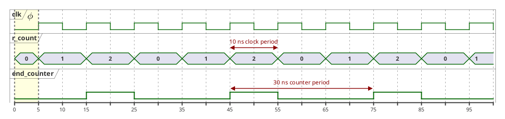
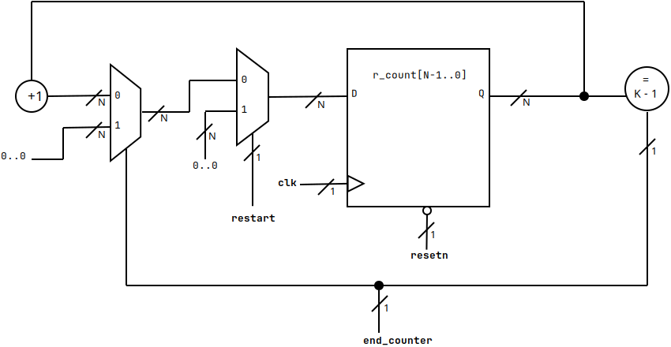
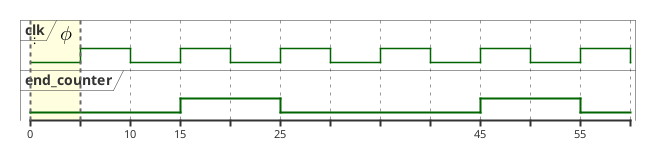
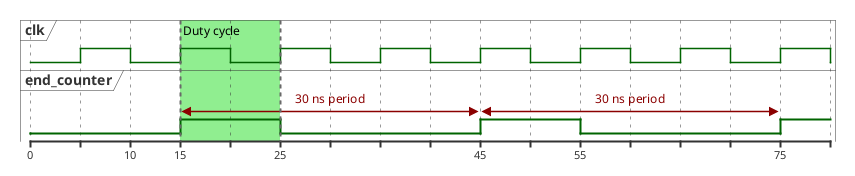
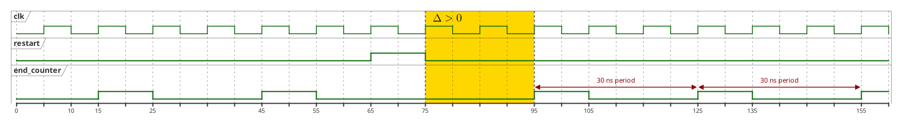
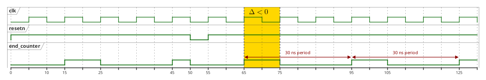

#+title: Plan de validation IADT - ~Counter_unit~
#+AUTHOR: Christophe Dufaza
#+LANGUAGE: fr
#+LATEX_CLASS: article
#+LATEX_HEADER: \usepackage[a4paper,bottom=2cm]{geometry}
#+OPTIONS: toc:2
#+LATEX: \tableofcontents

\newpage

* Spécifications

L'unité VHDL ~Counter_unit~ décrit un compteur modulo \(K\):
- \(Q_{0} = 0\)
- \(Q_{i+1} = Q_{i} + 1 \mod{K}\)

Pour un signal d'horloge de période \(T_{clk}\) et /duty cycle/ 50%:
- La périodicité du compteur sera \(T_{modK} = K \times T_{clk}\).
- Il produira en sortie un signal ~end_counter~ de forme d'onde de fréquence \(f_{modK} = \frac{f_{clk}}{K} \) et /duty cycle/ \(1 / K\).

Fig. [[fig-pulse_counter_mod3]] illustre les pulsations pour un compteur modulo 3 avec \(T_{clk} = 10\) ns, et une phase de 5 ns.

#+begin_src plantuml :file fig/pulse_end_counter_mod3.png :results silent
@startuml
'Clock period 10 ns (duty cycle 50%), 1st rising edge at 5ns'
clock "clk" as T with period 10 pulse 5 offset 5
concise "r_count" as COUNT
binary "end_counter" as DONE

@0
COUNT is 0
DONE is low

@5
COUNT is 1

@15
COUNT is 2
DONE is high

@25
COUNT is 0
DONE is low

@35
COUNT is 1

@45
COUNT is 2
DONE is high

@55
COUNT is 0
DONE is low

@65
COUNT is 1

@75
COUNT is 2
DONE is high

@85
COUNT is 0
DONE is low

@95
COUNT is 1

COUNT@45 <-> @55 : 10 ns clock period
DONE@45  <-> @75  : 30 ns counter period

highlight 0 to 5 #LightYellow;line:DimGrey : <latex>\ \ \ \phi</latex>
@enduml
#+end_src

#+CAPTION: Pulsations d'un compteur modulo 3.
#+NAME: fig-pulse_counter_mod3

** Interface

#+CAPTION: Paramètre de l'unité ~Counter_unit~.
#+NAME: table-conf_counter_unit
| /Générique/ | Configuration |
|-------------+---------------|
| ~K~           | Modulo        |

#+CAPTION: Ports I/O de l'unité ~Counter_unit~.
#+NAME: table-io_counter_unit
| Port        | Type | Signal                                        |
|-------------+------+-----------------------------------------------|
| ~clk~         | I    | Horloge \(f_{clk}\)                              |
| ~resetn~      | I    | nReset (asynchrone)                           |
| ~restart~     | I    | Remise à zéro (synchrone)                     |
| ~end_counter~ | O    | Signal modulo K \(f_{modK}\), /duty cycle/ \(1/K\) |

** RTL

Le compteur modulo \(K\) est enregistré (/registered/) dans un registre de largeur (/width/) \(N = \lceil log_{2}(K) \rceil\).

#+CAPTION: Description RTL de l'unité ~Counter_unit~.
#+NAME: fig-rtl_counter_unit

Fig [[fig-rtl_counter_unit]] rappelle la schématique RTL du compteur modulo \(K\).

\newpage

* Inspection

** I1 Interface

Vérifier l'interface VHDL de l'entité ~Counter_unit~:
- paramètre Table [[table-conf_counter_unit]]
- ports I/O Table [[table-io_counter_unit]]

L'inspection passe si l'interface VHDL de le l'entité ~Counter_unit~ décrit paramètre et ports I/O spécifiés.

** I2 Incrémentation modulo \(K\)

Vérifier la logique représentant l'incrémentation modulo K du compteur \(Q_{i} + 1 \mod{K}\) .

L'inspection passe si l'architecture VHDL de l'entité ~Counter_unit~ définit un signal combinatoire:
- représentant l'expression ~Q = K - 1~, évaluée lors de la mise à jour de ~Q~ sur front d'horloge montant
- pilotant le signal de sortie ~end_counter~

** I3 Registre N-bit

Vérifier la largeur (/width/) du registre mémorisant la valeur du compteur.

L'inspection passe si l'architecture VHDL de l'entité ~Counter_unit~ enregistre la valeur modulo \(K\) du compteur dans un registre de largeur \(N = \lceil log_{2}(K) \rceil\).

** I4 Remises à zéro synchrone et asynchrone

Vérifier les priorités des évènements synchrones et asynchrones:
- le signal d'entrée asynchrone ~resetn~ est /prioritaire/ devant le port d'entrée ~restart~
- le signal d'entrée synchrone ~restart~ est /prioritaire/ devant l'incrémentation synchrone du compteur

L'inspection passe si l'architecture VHDL de l'entité ~Counter_unit~ honore les priorités ci-dessus dans un unique bloc ~process(clk, resetn)~.

* Analyse

L'analyse vérifiera le comportement simulé du signal de sortie ~end_counter~.

Pour ces /testbench/ Vivado:
- Simuler un signal d'horloge de 100 MHz (\(T_{clk} = 10\) ns), avec une phase '[fn:: Délai avant le premier front d'horloge montant.]' de 5 ns.
- Paramétrer le compteur pour une périodicité de 30 ns, \(K = 3\).
- Au delà des chronographes produits, les vérifications sont automatiques (assertions ~assert~).

Les /instants/ spécifiés dans cette analyse sont des instant /idéaux/ de simulation, de durée 1 ns (l'unité temporelle par défaut pour les simulations Vivado est la nanoseconde). Les /testbench/ introduiront un délai de 1 ns entre l'incrémentation du compteur ou sa remise à zéro sur front d'horloge montant et l'observation du signal ~end_counter~ (simulation A3).  De même qu'entre la remise à zéro asynchrone du compteur et l'observation du signal ~end_counter~ (simulation A4).

** A1 Synchronisation

Vérifier la synchronisation du signal ~end_counter~ avec la phase de l'horloge.

Pour ce /testbench/ les signaux de remise à zéro ~resetn~ et ~restart~ sont désactivés.

L'analyse passe si la simulation vérifie:
- Le premier front montant du signal ~end_counter~ apparaît aux deuxième front d'horloge montant, à l'instant \(t = 15\ ns\)
- Le second front montant du signal ~end_counter~ apparaît trois front montants plus tard, à l'instant \(t = 45\ ns\)

#+begin_src plantuml :file fig/chrono_A1.png :results silent
@startuml
'Clock period 10 ns (duty cycle 50%), 1st rising edge at 5ns'
clock "clk" as CLK with period 10 pulse 5 offset 5
binary "end_counter" as DONE

@0
DONE is low

@15
DONE is high

@25
DONE is low

@45
DONE is high

@55
DONE is low

highlight 0 to 5 #LightYellow;line:DimGrey : :<latex>\ \ \ \phi</latex>
@enduml
#+end_src

#+CAPTION: Chronographe A1.
#+NAME: fig-chrono_A1

Fig. [[fig-chrono_A1]] illustre le comportement attendu.

** A2 Forme d'onde

Vérifier la forme d'onde du signal de sortie ~end_counter~.

Pour ce /testbench/ les signaux de remise à zéro ~resetn~ et ~restart~ sont désactivés.

L'analyse passe si la simulation vérifie '[fn:: Par exemple en testant le signal ~end_counter~ toutes les 10 ns sur l'intervalle \([15, 75]\) ns.]':
- La période du signal ~end_counter~  est 30 ns
- Le /duty cycle/ de la forme d'onde est 30%

#+begin_src plantuml :file fig/chrono_A2.png :results silent
@startuml
'Clock period 10 ns (duty cycle 50%), 1st rising edge at 5ns'
clock "clk" as CLK with period 10 pulse 5 offset 5
binary "end_counter" as DONE

@0
DONE is low

@15
DONE is high
@25
DONE is low

@45
DONE is high
@55
DONE is low

@75
DONE is high

DONE@15 <-> @45 : 30 ns period
DONE@45 <-> @75 : 30 ns period

highlight 15 to 25 #LightGreen;line:DimGrey : Duty cycle

@enduml
#+end_src

#+CAPTION: Chronographe A2.
#+NAME: fig-chrono_A2

Fig. [[fig-chrono_A2]] illustre le comportement attendu.

** A3 Remise à zéro synchrone (~restart~)

Vérifier la remise à zéro synchrone du compteur.

Pour ces /testbench/ le signal de remise à zéro asynchrone ~resetn~ est désactivé.

*** Partie 1

Le signal ~restart~ est initialement désactivé, puis activé pour une durée \(T_{clk}\):
- Lors du front d'horloge montant à \(t = 65\ ns\),  signal ~end_counter~ bas, au \(2/3\) d'une période

L'analyse passe si la simulation vérifie '[fn:: Par exemple en testant le signal ~end_counter~ toutes les 10 ns sur l'intervalle \([15, 155]\) ns.]':
- En conséquence de l'activation du signal ~restart~ à  \(t = 65\) ns, le prochain front montant du signal ~end_counter~ apparaît à \(t = 95\) ns, et non \(t = 75\) ns.
- Le signal est alors à nouveau synchronisé tel que \(f_{modK} = \frac{f_{clk}}{3}\).

#+begin_src plantuml :file fig/chrono_A3.png :results silent
@startuml
'Clock period 10 ns (duty cycle 50%), 1st rising edge at 5ns'
clock "clk" as CLK with period 10 pulse 5 offset 5
binary "restart" as RST
binary "end_counter" as DONE

@0
DONE is low
RST is low

@15
DONE is high
@25
DONE is low

@45
DONE is high
@55
DONE is low

@65
RST is high
@75
RST is low

@95
DONE is high
@105
DONE is low

@125
DONE is high
@135
DONE is low

@155
DONE is high

DONE@95 <-> @125 : 30 ns period
DONE@125 <-> @155 : 30 ns period

highlight 75 to 95 #Gold;line:DimGrey : <latex>\ \Delta \gt 0</latex>

@enduml
#+end_src

#+CAPTION: Chronographe A3.
#+NAME: fig-chrono_A3

Fig. [[fig-chrono_A3]] illustre le comportement attendu.

*** Partie 2
Le signal ~restart~ est initialement désactivé, puis activé pour une durée \(T_{clk}\):
- Lors du front d'horloge montant à \(t = 45\) ns,  c'est à dire sur un front montant du signal ~end_counter~

L'analyse passe si la simulation vérifie:
- L'activation du signal ~restart~ sur un front montant du signal  ~end_counter~ n'introduit aucune phase, le prochain front montant apparaît à \(t = 75\) ns

** A4 Remise à zéro asynchrone (~resetn~)

Vérifier la remise à zéro asynchrone du compteur.

Pour ce /testbench/ le signal de remise à zéro synchrone ~restart~ est désactivé.

Le signal ~resetn~ est initialement désactivé, puis activé pour une durée \(T_{clk} / 2\):
- Lors du front d'horloge descendant à \(t = 50\) ns,  signal ~end_counter~ haut.

L'analyse passe si la simulation vérifie  '[fn:: Par exemple en testant le signal ~end_counter~ toutes les 10 ns sur l'intervalle \([15, 125]\) ns.]':
- Le signal  ~end_counter~ est bas dès l'activation du signal ~resetn~ à \(t = 50\) ns.
- Le front montant suivant du signal  ~end_counter~ apparaît  à \(t = 65\) ns et non \(t = 75\) ns.
- Le signal est alors à nouveau synchronisé tel que \(f_{modK} = \frac{f_{clk}}{3}\).

#+begin_src plantuml :file fig/chrono_A4.png :results silent
@startuml
'Clock period 10 ns (duty cycle 50%), 1st rising edge at 5ns'
clock "clk" as CLK with period 10 pulse 5 offset 5
binary "resetn" as NRST
binary "end_counter" as DONE

@0
DONE is low
NRST is high

@15
DONE is high
@25
DONE is low

@45
DONE is high
@50
NRST is low
DONE is low
@55
NRST is high

@65
DONE is high
@75
DONE is low

@95
DONE is high
@105
DONE is low

@125
DONE is high

DONE@65 <-> @95 : 30 ns period
DONE@95 <-> @125 : 30 ns period

highlight 65 to 75 #Gold;line:DimGrey : <latex>\ \Delta \lt 0</latex>

@enduml
#+end_src

#+CAPTION: Chronographe A4.
#+NAME: fig-chrono_A4

Fig. [[fig-chrono_A4]] illustre le comportement attendu.

* Démonstration

La démonstration est effectuée sur carte cible Cora Z7 (~xc7z010clg00-1~):
- Signal d'horloge 125 MHz
- Connecter le port d'enrée ~resetn~ au bouton ~BTN0~
- Connecter le port d'enrée ~restart~ au bouton ~BTN1~
- Connecter le signal de sortie ~end_counter~ à un circuit alternant l'état d'une LED

L'unité ~Counter_unit~ est paramétrée pour une périodicité du compteur  \(T_{modK} = 1\)  seconde, \( K = 125.10^{6} \).

** D1 Comportement par défaut

Vérifier le comportement par défaut du circuit.

La démonstration passe si, après synchronisation avec la phase de l'horloge, la LED clignote /manifestement/ avec une période de \( 2 \times  T_{modK} = 2\) secondes, et /duty cycle/ 50% (LED allumée pendant 1 seconde, éteinte pendant une seconde).

** D2 Remise à zéro synchrone

Vérifier le comportement du circuit après remise à zéro synchrone (port d'entrée ~restart~) du compteur.

La démonstration passe si:
- Presser puis relâcher le bouton ~BTN1~ lorsque la LED est allumée: la remise à zéro du compteur éteint la LED, puis le clignotement reprend /au plus tard/ après 1 seconde (prochain front montant du signal ~end_counter~).
- Presser continuellement le bouton ~BTN1~: le compteur est remis à zéro sur chaque front d'horloge montant, la LED demeure éteinte, le clignement reprend lorsque le bouton est relâché.

** D3 Remise à zéro asynchrone

Vérifier le comportement du circuit après remise à zéro asynchrone (port d'entrée ~resetn~) du compteur.

La démonstration passe si:
- Presser puis relâcher le bouton ~BTN0~ lorsque la LED est allumée: la remise à zéro du compteur éteint la LED, puis le clignotement reprend /au plus tard/ après 1 seconde (prochain front montant du signal ~end_counter~).
- Presser continuellement le bouton ~BTN0~: le compteur est remis à zéro aussi rapidement que le circuit le permet, la LED demeure éteinte, le clignement reprend lorsque le bouton est relâché.

\newpage

* Tests

Les tests sont effectués sur carte cible Cora Z7 (~xc7z010clg00-1~):
- Signal d'horloge 125 MHz.
- Connecter le port d'enrée ~resetn~ au bouton ~BTN0~.
- Connecter le port d'enrée ~restart~ au bouton ~BTN1~.
- Connecter le signal de sortie ~end_counter~ à un circuit alternant l'état d'un port de sortie ~LED~.

** T1 Signal ~end_counter~ (ILA)

L'unité ~Counter_unit~ est paramétrée avec  \(K = 3_{}^{}\), pour une périodicité du compteur \(T_{modK} = 3 \times T_{clk} \).

Le test est effectué en plaçant une sonde /debug/ sur le net ~LED_OBUF~ connecté au port de sortie ~LED~.

Le test passe si:
- La période du signal instrumenté ~LED_OBUF~  correspond à \(3 \times 2 = 6\) périodes d'horloge.
- Le /duty cycle/ du signal instrumenté ~LED_OBUF~ est 50%: LED allumée pendant 3 périodes d'horloge, éteinte pendant 3 périodes d'horloge.

** T2 Remise à zéro synchrone (ILA)

L'unité ~Counter_unit~ est paramétrée avec  \(K = 3_{}^{}\), pour une périodicité du compteur \(T_{modK} = 3 \times T_{clk} \).

Le test est effectué en plaçant des sondes /debug/:
- sur le /net/ ~BTN1_IBUF~ connecté au port d'entrée ~BTN1~, avec condition de déclenchement  ~==R~  (front montant bouton).
- sur le /net/ ~LED_OBUF~ connecté au port de sortie ~LED~, avec  condition de déclenchement ~==1~ (LED allumée)

Le /trigger/ aura pour condition globale la conjonction (~AND~) des deux conditions ci-dessus (front montant bouton ~BTN1~ pendant que la LED est allumée).

Configurer le core ILA pour une fenêtre e.g. de 16384 échantillons '[fn:: Une fenêtre élargie facilitera le déclenchement du /trigger/.]' (/Window data depth/).

Activer le /trigger/ (/Run trigger for this ILA core/),  l'ILA est /waiting for trigger/.
Presser puis relâcher le bouton ~BTN1~ jusqu'à déclenchement du /trigger/ (l'ILA est /Idle/).

Le test passe si:
- La remise à zéro du compteur provoque l'extinction de la LED (signal instrumenté ~LED_OBUF~).

** T3 Remise à zéro asynchrone (ILA)

L'unité ~Counter_unit~ est paramétrée avec  \(K = 3_{}^{}\), pour une périodicité du compteur \(T_{modK} = 3 \times T_{clk} \).

Le test est effectué en plaçant des sondes /debug/:
- sur le /net/ ~BTN0_IBUF~ connecté au port d'entrée ~BTN0~, avec condition de déclenchement  ~==R~  (front montant bouton).
- sur le /net/ ~LED_OBUF~ connecté au port de sortie ~LED~, avec  condition de déclenchement ~==1~ (LED allumée)

Le /trigger/ aura pour condition globale la conjonction (~AND~) des deux conditions ci-dessus (front montant bouton ~BTN0~ pendant que la LED est allumée).

Configurer le core ILA pour une fenêtre e.g. de 16384 échantillons.

Activer le /trigger/ (/Run trigger for this ILA core/),  l'ILA est /waiting for trigger/.
Presser et relâcher le bouton ~BTN0~ jusqu'à déclenchement du /trigger/ (l'ILA est /Idle/).

Le test passe si:
- La remise à zéro du compteur provoque l'extinction de la LED (signal instrumenté ~LED_OBUF~).

** T4 Signal ~end_counter~ (oscilloscope)

L'unité ~Counter_unit~ est paramétrée avec  \( K = 125.10^{6} \), pour une périodicité du compteur \(T_{modK} = 1\) seconde.

Connecter un canal d'entrée ~CH~ de l'oscilloscope au port de sortie ~LED~.

Le test passe si:
- On observe sur le canal ~CH~ de l'oscilloscope un signal de fréquence \(\frac{f_{modK}}{2} = \frac{1}{2}\) MHz et /duty cycle/ 50%.
- Lorsque le signal ~CH~ est haut (LED est allumée), presser le bouton ~BTN1~ passe le signal ~CH~ à l'état bas (LED éteinte).
- Relâcher le bouton  ~BTN1~ restaure le signal de fréquence 0.5 MHz sur le canal ~CH~.
