#+title: TP4 – Pilotage de LED et mémoire
#+SUBTITLE: Partie 1
#+AUTHOR: Christophe Dufaza
#+LANGUAGE: fr
#+LATEX_CLASS: article
#+LATEX_HEADER: \usepackage[a4paper,bottom=2cm]{geometry}
#+OPTIONS: toc:2
#+LATEX: \tableofcontents

\newpage

* Question 1
#+begin_quote
Créez une architecture RTL permettant de faire clignoter une LED (par exemple la ~led0_r~) en utilisant le module ~Counter_unit~ du TP2 et une machine à état.
#+end_quote

** Architecture RTL
*** Interface
Les ports I/O sont donnés Table [[table-io_fsm_q1]].

#+CAPTION: Ports I/O FSM Question 1.
#+NAME: table-io_fsm_q1
| Port   | Type | Signal                     |
|--------+------+----------------------------|
| ~clk~    | I    | Horloge                    |
| ~resetn~ | I    | RST asynchrone, active-low |
| ~o_led~  | O    | Signal LED (/driver/)        |

#+CAPTION: Paramètre FSM Question 1.
#+NAME: table-conf_fsm_q1
| /Générique/ | Configuration         |
|-----------+-----------------------|
| ~D~         | Diviseur de fréquence |

Le circuit est paramétré par un diviseur de fréquence[fn:D] \(D\) tel que  \( T_{led} = D \times T_{clk} \).

Par exemple, si l'on souhaite un clignotement de période deux secondes (LED allumée une seconde, éteinte une seconde), à partir d'une horloge 100 MHz, on paramétrera le circuit avec \(D = \frac{2}{10^{-8}} = 2.10^{8} \).

[fn:D] Le modulo du compteur ~counter_unit~ est alors \(K = D/2\).

*** Final State Machine (FSM)

#+CAPTION: FSM Question 1
#+NAME: fig-fsm_q1
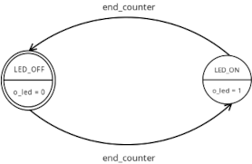

La machine à états ainsi que les sorties sont décrits Fig. [[fig-fsm_q1]]:
- Les transitions sont synchrones avec le signal de sortie ~end_counter~ d'un compteur ~counter_unit~.
- L'unique sortie ~o_led~ ne dépend que de l'état du FSM (Moore).

\newpage

* Question 2
#+begin_quote
Modifiez votre architecture pour piloter une LED rouge et une LED verte. Lorsque le ~bouton_0~ est appuyé, la LED verte est allumée, sinon la LED rouge est allumée.
#+end_quote

** Architecture RTL
*** Interface
Les ports I/O sont donnés Table [[table-io_fsm_q2]].

Le circuit est paramétré par un diviseur de fréquence \(D\).

#+CAPTION: Ports I/O FSM Question 2.
#+NAME: table-io_fsm_q2
| Port    | Type | Signal                     |
|---------+------+----------------------------|
| ~clk~     | I    | Horloge                    |
| ~resetn~  | I    | RST asynchrone, active-low |
| ~i_btn0~  | I    | Signal bouton              |
| ~o_led_r~ | O    | Signal LED rouge (/driver/)  |
| ~o_led_g~ | O    | Signal LED verte (/driver/)  |

#+CAPTION: Paramètre FSM Question 2.
#+NAME: table-conf_fsm_q2
| /Générique/ | Configuration         |
|-----------+-----------------------|
| ~D~         | Diviseur de fréquence |

*** Final State Machine (FSM)
Deux approches sont possibles selon que l'on considère le bouton en entrée:
- Come une variable de la fonction de transition d'un FSM de type Moore à 3 états, e.g. ~LED_OFF~ (LEDs éteintes), ~LED_RED~ (LED rouge allumée) et ~LED_GREEN~ (LED verte allumée). Les sorties dépendent uniquement de l'état du FSM.
- Comme une variable de la logique de sortie d'un FSM de type Mealy à deux états, ~LED_ON~ et ~LED_OFF~. Les sorties (pour l'état ~LED_ON~) dépendent alors également de l'entrée ~i_btn0~.

Le FSM de type Mealy semble mieux décrire un circuit logique de sortie tel qu'illustré par exemple Fig. [[fig-fsm_q2_mealy_output_r]] pour la LED rouge. Et évite d'introduire une variable asynchrone dans la fonction de transition du FSM.

#+CAPTION: Logique Mealy FSM Question 2 (LED rouge).
#+NAME: fig-fsm_q2_mealy_output_r
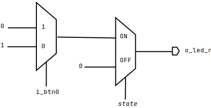

La machine à états ainsi que les sorties sont décrits Fig.  [[fig-fsm_q2]].

#+CAPTION: FSM Question 2.
#+NAME: fig-fsm_q2
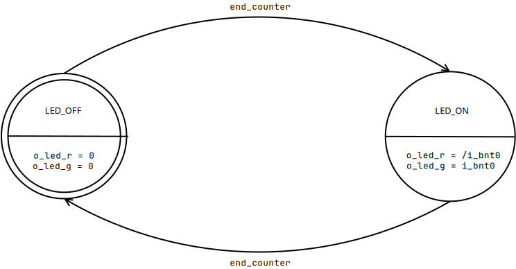

\newpage

* Question 3
#+begin_quote
Rédigez le code VHDL de votre architecture.
#+end_quote

** Architecture VHDL
Description VHDL du circuit Question 2: ~src/design/fsm_q3.vhd~

L'architecture VHDL est divisée en trois[fn:vhdl_q3] instructions (/blocs/) ~process()~:
- ~rtl~ (séquentiel, /clocked/): Enregistrement synchrone de l'état du FSM '[fn:: Le /reset/ asynchrone est également reçu ici.]'.
- ~next_state_logic~ (combinatoire):  Circuit logique déterminant l'/état suivant/ en fonction de l'entrée ~end_counter~.
- ~mealy_output_logic~ (combinatoire): Circuit logique déterminant l'état de la sortie en fonction de l'entrée ~i_btn0~ (Mealy).

[fn:vhdl_q3] Il s'agit simplement d'un choix d'écriture: ~next_state_logic~ et  ~mealy_output_logic~ pourraient être décrits par des instructions /conditional signal assignment/ (~when~) concurrentes.

* Question 4
#+begin_quote
Réalisez une simulation en rédigeant un testbench. Que se passe-t-il si le bouton est pressé pendant plus d’un cycle d’horloge ?
#+end_quote

** Simulation
- /Testbench/ VHDL: ~src/sim/tb_fsm_q4.vhd~
- Configuration /waveform/:  ~src/sim/tb_fsm_q4.wfg~

Le /testbench/ exécute deux processus:
- ~btn0_driver~: Pilote le bouton ~BTN0~.
- ~test_fsm~: Vérifie les transitions d'états du FSM et les ports de sortie du circuit.

Le comportement simulé du circuit est vérifié par les tests automatiques (~assert~), et illustré par le chronographe Fig. [[wvf-tb_fsm_q4]]: si le bouton est maintenu, la LED verte continue de clignoter, le clignotement de la LED rouge ne reprend que lorsque le bouton est relâché.

#+CAPTION: Chronographe /testbench/ ~tb_fsm_q4~.
#+NAME: wvf-tb_fsm_q4
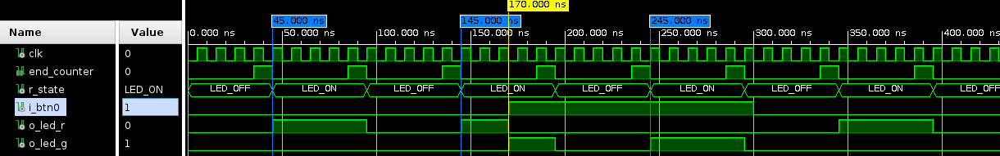

\newpage

* Question 5
#+begin_quote
Que faudrait-il faire pour que la LED ne clignote en vert qu’une seule fois même si le bouton est maintenu ?
#+end_quote

** /Held Down flag/
La LED verte n'est allumée que lorsque le bouton est pressé, s'il est relâché la LED rouge lui est substituée.

Un approche assez simple pour limiter les cycles allumé/éteint consécutifs de la LED verte est alors:
- Lever un /held down flag/ lorsque le bouton est maintenu lors d'une transition allumé/éteint.
- Ignorer le bouton tant que le /flag/ est levé.
- Baisser le /flag/ dès que le bouton est relâché.

* Question 6
#+begin_quote
Ajoutez cette solution à votre architecture RTL.
#+end_quote

** Architecture RTL
*** Interface
L'interface est inchangée. Voir Tables [[table-io_fsm_q2]] et  [[table-conf_fsm_q2]] .

*** Final State Machine (FSM)
Le registre /held down flag/ est une nouvelle variable de la logique de sortie Mealy, qui conserve par ailleurs sa nature purement combinatoire tel qu'illustré par exemple Fig [[fig-fsm_q6_mealy_output_r]] pour la LED rouge.

#+CAPTION: Logique Mealy FSM Question 6 (LED rouge).
#+NAME: fig-fsm_q6_mealy_output_r
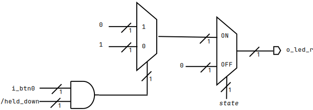

La machine à états ainsi que les sorties sont décrits Fig. [[fig-fsm_q6]].

#+CAPTION: FSM Question 6.
#+NAME: fig-fsm_q6
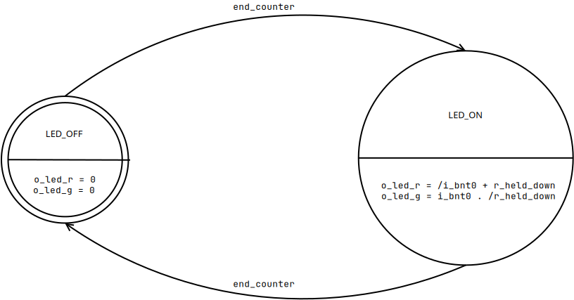

\newpage

* Question 7

#+begin_quote
Mettez à jour votre code VHDL et vérifiez votre résultat à la simulation.
#+end_quote

** Architecture VHDL
Description VHDL du  circuit Question 6: ~src/design/fsm_q7.vhd~

L'architecture VHDL est divisée en trois instructions (/blocs/) ~process()~:
- ~rtl~ (séquentiel, /clocked/): Enregistrement synchrone de l'état du FSM et /held down flag/  ~r_held_down~.
- ~next_state_logic~ (combinatoire):  Circuit logique déterminant l'/état suivant/ en fonction de l'entrée ~end_counter~.
- ~mealy_output_logic~ (combinatoire): Circuit logique déterminant l'état des sorties en fonction des /variables/ ~i_btn0~ et ~r_held_down~ (Mealy).

** Simulation
- /Testbench/ VHDL: ~src/sim/tb_fm_q7.vhd~
- Configuration /waveform/:  ~src/sim/tb_fsm_q7.wfg~

Le /testbench/ exécute deux processus:
- ~btn0_driver~: Pilote le bouton ~BTN0~.
- ~test_fsm~: Vérifie les transitions d'états du FSM et les ports de sortie du circuit.

Le comportement simulé du circuit est vérifié par les tests automatiques (~assert~), et illustré par le chronographe Fig. [[wvf-tb_fsm_q7]]: le clignotement de la LED rouge reprend dès la période suivante, même si le bouton est maintenu.

#+CAPTION: Chronographe /testbench/ ~tb_fsm_q7~.
#+NAME: wvf-tb_fsm_q7
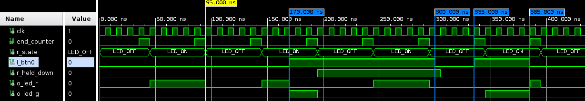

\newpage

* Question 8
#+begin_quote
Créez un module de pilotage d’une LED RGB en RTL. Ce dernier doit permettre de faire clignoter une LED RGB connectée en sortie d’une couleur définie par un code couleur donné en entrée. Le changement de couleur de la LED RGB n’a lieu que si un signal ~update~ est reçu.
#+end_quote

** Architecture RTL
*** Interface
Les ports I/O sont donnés Table [[table-io_fsm_q8]].

#+CAPTION: Ports I/O FSM Question 8.
#+NAME: table-io_fsm_q8
| Port       | Type | Signal                                          |
|------------+------+-------------------------------------------------|
| ~clk~        | I    | Horloge                                         |
| ~resetn~     | I    | RST asynchrone, active-low                      |
| ~update~     | I    | Enregistrement (synchrone) code couleur /enabled/ |
| ~color_code~ | I    | Code couleur (2-bit)                            |
| ~led_r~      | O    | Signal pilote (/driver/) LED rouge                |
| ~led_g~      | O    | Signal pilote (/driver/) LED verte                |
| ~led_b~      | O    | Signal pilote (/driver/) LED bleue                |

Le circuit est paramétré par un diviseur de fréquence \(D\).

#+CAPTION: Paramètre FSM Question 8.
#+NAME: table-conf_fsm_q8
| /Générique/ | Configuration         |
|-----------+-----------------------|
| ~D~         | Diviseur de fréquence |

Les codes couleur sont donnés Table [[table-color_codes_q8]].

#+CAPTION: Code couleurs.
#+NAME: table-color_codes_q8
| ~colode_code~ | Code couleur | Couleur           |
|-------------+--------------+-------------------|
| ~COLOR_NONE~  | ~00~           | LEDs éteintes.    |
| ~COLOR_RED~   | ~01~           | LED rouge allumée |
| ~COLOR_GREEN~ | ~10~           | LED verte allumée |
| ~COLOR_BLUE~  | ~11~           | LED bleue allumée |

\newpage

*** Final State Machine (FSM)
Le code couleur est enregistré tel que décrit Fig. [[fig-r_color_q8]]:
- sur front d'horloge montant, dans le nouveau registre de largeur 2-bit ~r_color~
- seulement si le signal ~update~ est haut

#+CAPTION: Code couleur FSM Question 8.
#+NAME: fig-r_color_q8
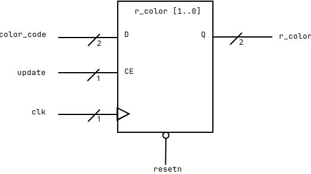

Le code couleur est une variable du circuit logique de sortie (Mealy), tel qu'illustré [fn:: Les code couleur sont abrégés, par exemple ~R~ se lit ~COLOR_RED~, et ~N~ se lit ~COLOR_NONE~.] par exemple Fig. [[fig-fsm_q8_mealy_output_r]] pour la LED rouge.

#+CAPTION: Logique Mealy FSM Question 8 (LED rouge).
#+NAME: fig-fsm_q8_mealy_output_r
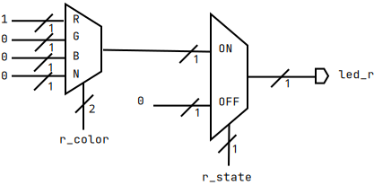

\newpage

La machine à états ainsi que les sorties sont décrits Fig. [[fig-fsm_q8]].

#+CAPTION: FSM Question 8.
#+NAME: fig-fsm_q8
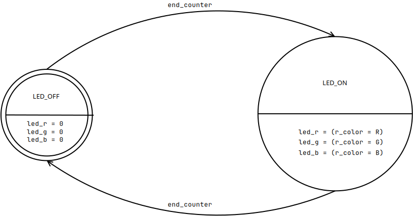

* Question 9
#+begin_quote
 Ajouter la logique nécessaire pour piloter les entrées/sorties de votre module.
- Le signal ~update~ doit recevoir 1 uniquement lorsque le ~bouton_0~ vient d’être appuyé, maintenir le bouton enfoncé ne doit pas maintenir le signal ~update~ à 1.
- Le signal ~color_code~ doit recevoir soit le code couleur « vert » si le ~bouton_1~ est pressé, il doit recevoir le code couleur « bleu » sinon
- Les LED R, G et B sont connectées avec les couleurs respectives de la ~LED_0~
#+end_quote

** Architecture RTL
*** Interface
Les ports I/O sont donnés Table [[table-io_fsm_q9]].

#+CAPTION: Ports I/O FSM Question 9.
#+NAME: table-io_fsm_q9
| Port   | Type | Signal                               |
|--------+------+--------------------------------------|
| ~clk~    | I    | Horloge                              |
| ~resetn~ | I    | RST asynchrone, active-low           |
| ~BTN0~   | I    | Bouton d'enregistrement code couleur |
| ~BTN1~   | I    | Bouton de sélection cod couleur      |
| ~LED0_R~ | O    | Signal LED rouge (/driver/)            |
| ~LED0_G~ | O    | Signal LED verte (/driver/)            |
| ~LED0_B~ | O    | Signal LED bleue (/driver/)            |

Le circuit est paramétré par un diviseur de fréquence \(D\).

#+CAPTION: Paramètre FSM Question 9.
#+NAME: table-conf_fsm_q9
| /Générique/ | Configuration         |
|-----------+-----------------------|
| ~D~         | Diviseur de fréquence |

*** Circuit LED driver
Le code couleur est maintenant enregistré tel que décrit  Fig. [[fig-led_driver_q9]]:
- sur front d'horloge montant
- sur front montant du bouton ~BTN0~
- le code couleur est déterminé par le bouton ~BTN1~

#+CAPTION: Circuit LED driver Question 9.
#+NAME: fig-led_driver_q9
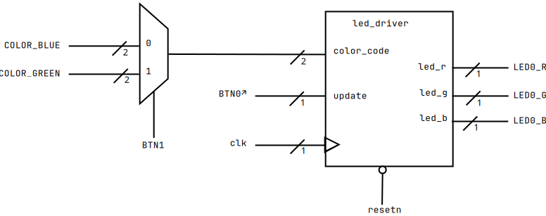

* Question 10
#+begin_quote
Ecrivez le code VHDL correspondant à votre architecture.
#+end_quote

** Architecture VHDL
Description VHDL du circuit Question 9:  ~src/design/top_led_driver.vhd~

L'architecture VHDL exécute une unique instruction ~process()~ séquentielle (/clocked/) qui enregistre l'état du bouton ~BTN0~ afin de détecter ses fronts montants et piloter le port d'entrée ~update~ du /driver/ ~led_driver~.

Les logique purement combinatoires sont ici décrites par des instructions /conditional signal assignment/ (~when~) concurrentes.

* Question 11
#+begin_quote
Ecrivez un testbench pour tester votre design.
#+end_quote

** /Testbench/
- /Testbench/ VHDL: ~src/sim/tb_top_led_driver.vhd~
- Configuration /waveform/:  ~src/sim/tb_top_led_driver.wfg~

Le /testbench/ exécute deux processus:
- ~update_color_code~: Pilote ~BTN0~ et ~BTN1~ pour enregistrer les codes couleurs.
- ~test_led_driver~: Vérifie l'état des LEDs en sortie.

\newpage

* Question 12
#+begin_quote
Vérifier votre résultat à la simulation.
#+end_quote

** Simulation
Le comportement simulé du circuit est vérifié par les tests automatiques (~assert~), et illustré par le chronographe Fig. [[wvf-tb_top_led_driver]]:
- Initialement, la LED rouge clignote.
- À \(t = 135\) ns, ~BTN0~ est pressé pendant que ~BTN1~ est bas: au front d'horloge suivant, la LED bleue s'allume à la place de la LED rouge.
- À \(t = 175\) ns, ~BTN0~ est pressé pendant que ~BTN1~ est haut: au front d'horlog suivant la LED verte s'allume à la place de la LED bleue, puis lors du prochain cycle allumé-éteint à \(t = 245\) ns c'est la LED rouge qui clignote, bien que ~BT1~ ait été maintenu jusque là.
- Le bouton ~BTN0~ est ensuite maintenu sur l'intervalle \([315, 465]\) ns, ~BTN1~ étant initialement bas puis haut: seul le premier changement de couleur vers ~COLOR_BLUE~ est enregistré, le second vers ~COLOR_GREEN~ à \(t = 455\) ns est ignoré.

#+CAPTION: Chronographe /testbench/ ~tb_top_led_driver~.
#+NAME: wvf-tb_top_led_driver
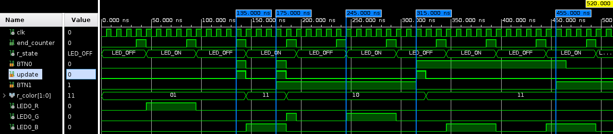

\newpage

* Question 13
#+begin_quote
Réalisez une synthèse et étudiez le rapport de synthèse, les ressources utilisées doivent correspondre à votre schéma RTL.
#+end_quote

** Synthèse
*** Rapports d'utilisation
- Utilization Design Information: ~synth/top_led_driver_utilization_synth.rpt~
- Synthesis report: ~synth/top_led_driver.vds~

#+CAPTION: Summary of Registers by Type.
#+NAME: table-synth_registers_top_led_driver
| Total | Clock Enable | Synchronous | Asynchronous |
|-------+--------------+-------------+--------------|
|     1 | Yes          | -           | Set          |
|    30 | Yes          | -           | Reset        |

#+CAPTION: Primitives (synthèse).
#+NAME: table-synth_primitives_top_led_driver
| Ref Name | Used | Functional Category |
|----------+------+---------------------|
| LUT6     |   36 | LUT                 |
| FDCE     |   30 | Flop & Latch        |
| CARRY4   |    7 | CarryLogic          |
| LUT3     |    4 | LUT                 |
| IBUF     |    4 | IO                  |
| OBUF     |    3 | IO                  |
| LUT4     |    2 | LUT                 |
| LUT1     |    1 | LUT                 |
| FDRE     |    1 | Flop & Latch        |
| FDPE     |    1 | Flop & Latch        |
| BUFG     |    1 | Clock               |

Les 30 primitives FDCE (D Flip-Flop with Clock Enable and Asynchronous Clear) sont aisément identifiables:
- ~counter_unit~: Le compteur est paramétré avec \(K = \frac{D}{2} = \frac {2.10^{8}}{2} = 10^{8} \), et requière donc \(\lceil log_{2}(10^{8}) \rceil = 27 \) bits, initialisés à zéro, soit 27 FDCE.
- ~led_driver~: Requière un FDCE pour enregistrer l'état du FSM '[fn:: Machine à 2 états, /binary encoded/.]' (valeur initiale  zéro), plus un FDCE pour enregistrer le MSB du code couleur '[fn:: Le LSB du code couleur, initialisé à ~1~, est enregistré dans un FDPE (D Flip-Flop with Clock Enable and Asynchronous Preset).]' (couleur initiale ~COLOR_RED = 01~, MSB initialisé à ~0~), soit 2 FDCE.
- ~top_led_driver~: Requière un FDCE pour détecter les fronts montants du bouton ~BTN0~.

La plupart des LUT6 représentent la comparaison de la valeur du compteur modulo \(K\) avec \(10^{8} - 1\).

Les 4 IBUF représentent les ports d'entrée ~clk~, ~resetn~, ~BTN0~ et ~BTN1~.

Les 3 OBUF représentent les ports de sortie ~LED0_R~,   ~LED0_G~,   ~LED0_B~.

\newpage

Parmi les composants RTL on identifie:
- Le registre 2-bit pour enregistrer le code couleur
- Un registre 1-bit pour enregistrer l'état du FSM
- Un registre 1-bit pour la détection des fronts montants du bouton ~BTN0~
- L'essentiel de MUX représente la logique des sorties Mealy vers les LEDs.

#+begin_example
Detailed RTL Component Info :
+---Registers :
                2 Bit    Registers := 1
                1 Bit    Registers := 2
+---Muxes :
   2 Input    2 Bit        Muxes := 1
   2 Input    1 Bit        Muxes := 1
   3 Input    1 Bit        Muxes := 1
   4 Input    1 Bit        Muxes := 1
   5 Input    1 Bit        Muxes := 1
#+end_example

*** Rapport de /timing/ (STA)
- Timing Summary Report: ~synth/timing_report.txt~

On vérifie dans le rapport de /timing/ que l'analyse du circuit synthétisé produit des valeurs nulles pour /Total Negative Slack/ (TNS) et /Total Hold Stack/ (THS).

#+CAPTION: Design Timing Summary.
#+NAME: table-synth_timing_summary
| WNS(ns) | TNS(ns) | WHS(ns) | THS(ns) | WPWS(ns) | TPWS(ns) |
|---------+---------+---------+---------+----------+----------|
|   4.703 | *0.000*   |   0.144 | *0.000*   |    4.500 | *0.000*    |

\newpage

* Question 14
#+begin_quote
Effectuez le placement routage et étudiez les rapports.
#+end_quote

** Implémentation

À partir de l'/implémentation/, nous utiliserons le fichier de contraintes ~src/const/top_led_driver.xdc~.

*** Place & route
- IO Place Design: ~impl/top_led_driver_io_placed.rpt~
- Utilization - Place Design: ~impl/top_led_driver_utilization_placed.rpt~
- DRC Route Design: ~impl/top_led_driver_drc_routed.rpt~

Les ressources /placées/ correspondent aux ressources synthétisées.

#+CAPTION: Primitives (implémentation).
#+NAME: table-impl_primitives_top_led_driver
| Ref Name | Used | Functional Category |
|----------+------+---------------------|
| LUT6     |   36 | LUT                 |
| FDCE     |   30 | Flop & Latch        |
| CARRY4   |    7 | CarryLogic          |
| LUT3     |    4 | LUT                 |
| IBUF     |    4 | IO                  |
| OBUF     |    3 | IO                  |
| LUT4     |    2 | LUT                 |
| LUT1     |    1 | LUT                 |
| FDPE     |    1 | Flop & Latch        |
| BUFG     |    1 | Clock               |

*** Rapports de /timing/
- Timing Summary - Placed Design: ~impl/top_led_driver_timing_summary_placed.rpt~
- Timing Summary - Route Design: ~impl/top_led_driver_timing_summary_routed.rpt~
- Clock Utilization - Route Design: ~impl/top_led_driver_clock_utilization_routed.rpt~

On vérifie dans le rapport de /timing/ que l'analyse du circuit /implémenté/ produit de même des valeurs nulles pour /Total Negative Slack/ (TNS) et /Total Hold Stack/ (THS).

#+CAPTION: Design Timing Summary.
#+NAME: table-impl_timing_summary
| WNS(ns) | TNS(ns) | WHS(ns) | THS(ns) | WPWS(ns) | TPWS(ns) |
|---------+---------+---------+---------+----------+----------|
|   4.469 | *0.000*   |   0.236 | *0.000*   |    4.500 | *0.000*    |

L'horloge pilotant le circuit confirme la configuration décrites dans le fichier de contraintes (fréquence, /duty cycle/, phase [fn:phase: Délai initial avant le premier front d'horloge montant.] ).

#+CAPTION: Clock Summary.
#+NAME: table-clock_summary
| Clock       | Waveform(ns)  | Period(ns) | Frequency(MHz) |
|-------------+---------------+------------+----------------|
| ~sys_clk_pin~ | {0.000 5.000} |     10.000 |        100.000 |

#+CAPTION: Clock Region Cell Placement per Global Clock.
#+NAME: table-clock_region
| Driver Type/Pin | Constraint | Clock Region | Source Period | Source Clock | Net      |
|-----------------+------------+--------------+---------------+--------------+----------|
| IBUF/O          | ~IOB_X0Y74~  | ~X1Y1~         |        10.000 | ~sys_clk_pin~  | ~clk_IBUF~ |

* Question 15
#+begin_quote
Générez le bitstream et vérifiez que vous avez le comportement attendu sur carte.
#+end_quote

- Fichier de contraintes configurant les ports I/O du FPGA: ~src/const/top_led_driver.xdc~
- Bitstream (2 MB): ~impl/top_led_driver.bit~

** Ports I/O et signal ~resetn~

La plupart des interfaces (entités) VHDL définies ici spécifient un port d'entrée pour la remise à zéro asynchrone des registres,  ~resetn~, habituellement connecté à un bouton.

Ce port ne peut être laissé /flottant/:

#+begin_verse
[DRC NSTD-1] Unspecified I/O Standard: 1 out of 7 logical ports use I/O standard (IOSTANDARD) value 'DEFAULT', instead of a user assigned specific value. This may cause I/O contention or incompatibility with the board power or connectivity affecting performance, signal integrity or in extreme cases cause damage to the device or the components to which it is connected. Problem ports: resetn.
#+end_verse

Les deux boutons de la carte Cora Z7 (~xc7z010clg400-1~) étant dédiés à l'/interface utilisateur/ du circuit ~top_led_driver~, une approche peut être de connecter ce port d'entrée à un port GPIO inutilisé de la carte, par exemple le port ~U14~ du ChipKit Outer Digital Header.
Le signal ~resetn~ étant active-low, le port d'entrée est /pulled-up/.

#+begin_src
set_property -dict {PACKAGE_PIN U14 IOSTANDARD LVCMOS33} [get_ports resetn];
set_property PULLUP true [get_ports resetn]
#+end_src

** Démonstration

Scénario de démonstration vérifié sur carte Cora Z7 (~xc7z010clg400-1~):
1. Au démarrage la LED rouge clignote.
2. /Clicker/ sur le bouton ~BTN1~ (presser puis relâcher): le circuit ne change pas de comportement.
3. Presser et maintenir le ~BTN1~, puis /clicker/ sur le bouton ~BTN0~ (et enfin relâcher le bouton ~BTN1~): la LED verte se substitue à la LED rouge, soit immédiatement (état ~LED_ON~), soit lors du prochain cycle allumé-éteint (état ~LED_OFF~).
4. /Clicker/ sur le bouton ~BTN0~:  la LED bleue se substitue à la LED verte, soit immédiatement (état ~LED_ON~), soit lors du prochain cycle allumé-éteint (état ~LED_OFF~).
5. Presser et maintenir le ~BTN0~, puis /clicker/ le boutons ~BTN1~: l'unique changement de code couleur permis par pression du bouton ~BTN0~ (front montant) a déjà été enregistré (/de bleu à bleu/), et lorsque le bouton ~BTN1~ est /clické/ le changement de couleur (à vert) est ignoré.
6. Presser et maintenir le bouton ~BTN1~, puis presser et maintenir le bouton ~BTN0~, et relâché le bouton ~BTN1~: l'unique changement de code couleur permis par pression du bouton ~BTN0~ (front montant) a déjà été enregistré (de bleu à vert), et lorsque le bouton ~BTN1~ est relâché le changement de couleur (de vert à bleu) est ignoré.
