#+title: TP5 –  Domaines d’horloge
#+AUTHOR: Christophe Dufaza
#+LANGUAGE: fr
#+LATEX_CLASS: article
#+LATEX_HEADER: \usepackage[a4paper,top=2cm, bottom=2cm]{geometry}
#+LATEX_HEADER: \usepackage{hyperref}
#+LATEX_HEADER: \hypersetup{colorlinks=true,linkcolor=cyan}
#+LATEX_HEADER: \usepackage{graphicx}
#+OPTIONS: date:nil
#+OPTIONS: toc:2
#+LATEX: \tableofcontents

\newpage

* Question 1
#+begin_quote
A l’aide du module ~LED_driver~ du TP4, créez une architecture RTL permettant de piloter les deux LED RGB.
Les LEDs RGB devront clignoter 10 fois en rouge puis 10 fois en bleu et 10 fois en vert avant de recommencer à partir du rouge.
En entrée des modules ~LED_driver~ le signal ~update~ ne devra pas être à 1 pendant plus d’un coup d’horloge. Il doit s’agir d’une impulsion.

Le compteur de temporisation devra compter 100 000 000 coups d’horloge (pour une fréquence d’horloge à 100MHz, cela correspond à 1s). *Dans la suite de ce TP, la valeur du compteur de temporisation ne sera pas modifiée, même lorsque les fréquences d’horloges changeront.*
#+end_quote

** Architecture RTL
*** Code couleurs
Les couleurs rouge, bleue, et vert sont définies à la fois[fn:color_codes]:
- Comme codes binaires de largeur 2-bit apparaissant dans les I/O des circuits.
- Comme une suite 1-indexée, permettant d'itérer sur les couleurs dans l'ordre produisant la séquence LED demandée (rouge, bleu, vert). Une itération dans cette suite modifie un unique bit de code couleur (/gray codes/).

[fn:color_codes] Voir aussi le /package/ ~src/design/color_codes_pkg.vhd~.

#+CAPTION: Code couleurs.
#+NAME: table:color_codes
| ~colode_code~ | Code couleur | Couleur  |
|-------------+--------------+----------|
| ~COLOR_NONE~  | ~00~           | /Réservé/. |
| ~COLOR_RED~   | ~01~           | Rouge    |
| ~COLOR_BLUE~  | ~10~           | Bleu     |
| ~COLOR_GREEN~ | ~11~           | Vert     |

*** Interface
Les ports I/0 du circuit pilotant deux LEDs sont donnés Table [[table:io_circuit_q1]].

#+CAPTION: Ports I/O circuit Question 1.
#+NAME: table:io_circuit_q1
| Port   | Type | Signal                                  |
|--------+------+-----------------------------------------|
| ~clk~    | I    | Horloge                                 |
| ~resetn~ | I    | Reset asynchrone, active-low            |
| ~LED0_R~ | O    | Signal pilote (/driver/) LED0 canal rouge |
| ~LED0_G~ | O    | Signal pilote (/driver/) LED0 canal vert  |
| ~LED0_B~ | O    | Signal pilote (/driver/) LED0 canal bleu  |
| ~LED1_R~ | O    | Signal pilote (/driver/) LED1 canal rouge |
| ~LED1_G~ | O    | Signal pilote (/driver/) LED1 canal vert  |
| ~LED1_B~ | O    | Signal pilote (/driver/) LED1 canal bleu  |

Le circuit est paramétré par un diviseur de fréquence[fn:D]  \(D\) tel que la période d'un cycle allumé-éteint est  \(D \times T_{clk}\).
Pour un clignotement de période deux secondes (LEDs allumées une seconde, éteintes une seconde), à partir d'une horloge 100 MHz, on paramétrera le circuit avec \(D = \frac{2}{10^{-8}} = 2.10^{8} \).

[fn:D] On en déduit le modulo \(K = D/2 = 10^{8} \) du /compteur de temporisation/ ~counter_unit~.

#+CAPTION: Paramètre circuit Question 1.
#+NAME: table:generic_q1
| /Générique/ | Configuration         |
|-----------+-----------------------|
| ~D~         | Diviseur de fréquence |

\newpage

*** Circuit
Les codes couleur sont générés par le circuit ~color_iter~ décrit Fig. [[fig:rtl_color_iter]]: une pulsation en entrée ~cc_next~ provoque une itération dans la suite des couleurs, puis, au front d'horloge suivant, une pulsation ~cc_ready~ indique que le code couleur correspondant peut être lu[fn:cc_data] sur la sortie ~cc_data~.

[fn:cc_data] Le registre ~cc_data~ sera alors stable jusqu'au prochain changement de couleur après dix clignotements, soit pendant \(10 \times 2.10^{8}\) périodes d'horloge. Cette remarque nous permettra de mieux interpréter une violation de contrainte /Hold Time/ rapportée par les rapports de synthèse.

#+CAPTION: Générateur de codes couleur.
#+NAME: fig:rtl_color_iter
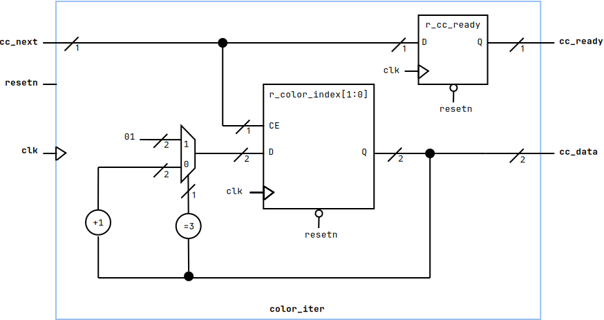

Le circuit complet est décrit Fig. [[fig:rtl_q1]].

#+CAPTION: Circuit Question 1.
#+NAME: fig:rtl_q1
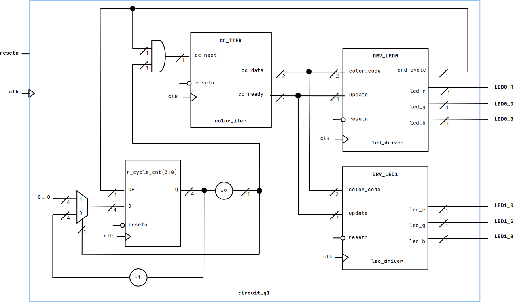

Plutôt que de dupliquer les élément du circuit pour piloter chacune des LEDs, les deux LEDs sont pilotées /via/ les mêmes signaux ~cc_data~  et ~cc_ready~. C'est le signal ~end_cycle~ du /driver/ connecté à la LED ~LED0~ qui rythme les changements de couleur[fn:end_cycle].

[fn:end_cycle] La sortie ~end_cycle~ du /driver/ connecté à la LED ~LED1~ est désactivée (/open/).

Le registre ~r_cycle_cnt~ est un compteur synchrone ascendant modulo 10, incrémenté par impulsion ~end_cycle~.
Il produit en sortie une pulsation ~cc_next~ tous les dix cycles.

* Question 2
#+begin_quote
Rédigez le code VHDL correspondant à votre architecture.
#+end_quote

** Architecture VHDL
Sources VHDL:
- Description du circuit Question 1: ~src/design/circuit_q1.vhd~
- Codes couleurs (/package/): ~src/design/color_codes_pkg.vhd~

L'architecture de l'entité ~cirquit_q1~ décrit littéralement le circuit Fig. [[fig:rtl_q1]].

* Question 3
#+begin_quote
Rédigez le testbench et simulez votre design.
Vérifiez que les modules réceptionnent correctement le signal ~update~.
#+end_quote

** Simulation
/Testbench/:
- UUT: ~cirquit_q1~
- VHDL: ~src/sim/tb_cirquit_q1.vhd~
- Configuration /waveform/: ~src/sim/tb_circuit_q1.wcfg~
- Pour la simulation, les circuits ~led_driver~ sont configurés pour un cycle allumé-éteint de 10 périodes d'horloge (5 périodes LEDs allumées, 5 périodes LEDs éteintes): ~D~ = 10, \(K=5\).

L'objet de la simulation est de vérifier:
- Les LEDs clignotent simultanément, avec la même couleur.
- Les changements de couleur apparaissent après dix clignotement des LEDs.
- Le stimulus ~update~ est une pulsation d'un cycle d'horloge.

Le rythme et les couleurs de clignotement des LEDS sont vérifiables (observables) Fig. [[fig:wvf_tb_circuit_q1_3200ns]].

#+CAPTION: Chronographe ~tb_circuit_q1~ (3200 ns).
#+NAME: fig:wvf_tb_circuit_q1_3200ns
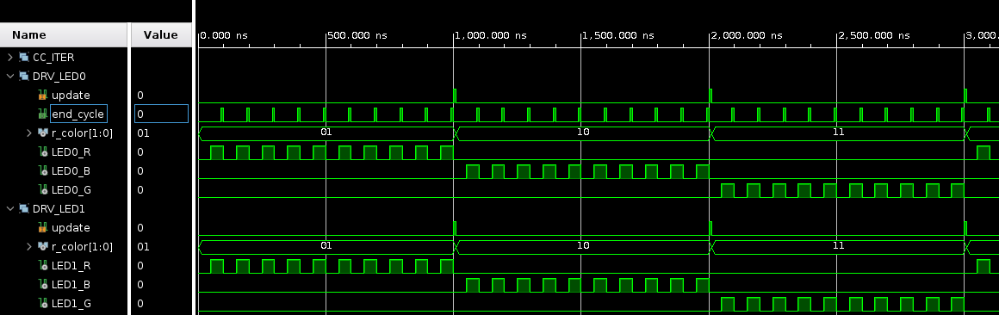

\newpage

La durée du stimulus ~update~ est vérifiée (observée) Fig. [[fig:wvf_tb_circuit_q1_1300ns]].

#+CAPTION: Stimulus ~update~.
#+NAME: fig:wvf_tb_circuit_q1_1300ns
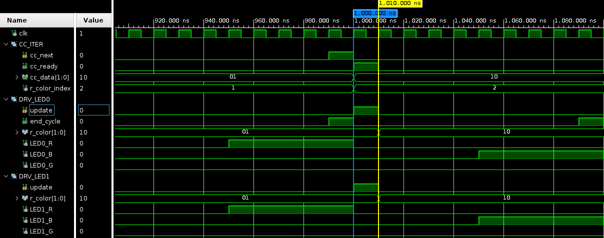

* Question 4
#+begin_quote
Modifiez votre design pour gérer deux signaux d’horloge différents.
La première horloge, ~clkA~, est associé à la logique en dehors des modules ~LED_driver~ et au module ~LED_driver~ de la ~LED0~.
La deuxième horloge, ~clkB~, est associé au module ~LED_driver~ de la ~LED1~.
Le changement de couleur des deux LEDs à lieu lorsque la LED0 à clignoté 10 fois.
#+end_quote

** Architecture RTL
L'architecture RTL du circuit comprend maintenant deux domaines d'horloge:
- Domaine \(A\), signal d'horloge ~clk_A~: ~DRV_LED0~, ~CC_ITER~, et ~r_cycle_cnt~.
- Domaine \(B\), signal d'horloge ~clk_B~: ~DRV_LED1~

*** Interface
Les ports I/0 du circuit modifié sont donnés Table [[table:io_circuit_q4]].

#+CAPTION: Ports I/O circuit Question 4.
#+NAME: table:io_circuit_q4
| Port   | Type | Signal                                  |
|--------+------+-----------------------------------------|
| ~clk_A~  | I    | Horloge domaine ~A~                       |
| ~clk_B~  | I    | Horloge domaine ~B~                       |
| ~resetn~ | I    | Reset asynchrone, active-low            |
| ~LED0_R~ | O    | Signal pilote (/driver/) LED0 canal rouge |
| ~LED0_G~ | O    | Signal pilote (/driver/) LED0 canal vert  |
| ~LED0_B~ | O    | Signal pilote (/driver/) LED0 canal bleu  |
| ~LED1_R~ | O    | Signal pilote (/driver/) LED1 canal rouge |
| ~LED1_G~ | O    | Signal pilote (/driver/) LED1 canal vert  |
| ~LED1_B~ | O    | Signal pilote (/driver/) LED1 canal bleu  |

\newpage

*** Circuit
Le circuit modifié est décrit Fig. [[fig:rtl_q4]].

#+CAPTION: Circuit Question 4.
#+NAME: fig:rtl_q4
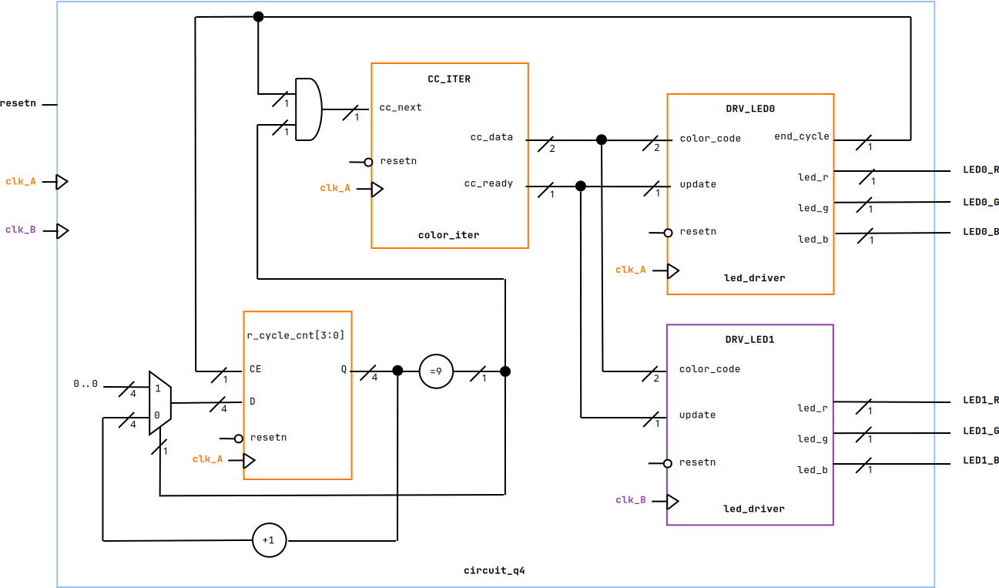

** Architecture VHDL
Sources VHDL:
- Description du circuit Question 4: ~src/design/circuit_q4.vhd~
- Codes couleurs (/package/): ~src/design/color_codes_pkg.vhd~

L'architecture de l'entité ~cirquit_q4~ décrit littéralement le circuit Fig. [[fig:rtl_q4]].

** Simulation
/Testbench/:
- UUT: ~cirquit_q4~, \(f_{clkA}=f_{clkB}\)
- VHDL: ~src/sim/tb_cirquit_q4.vhd~
- Configuration /waveform/: ~src/sim/tb_circuit_q4.wcfg~
- Paramètre ~D~ = 10, \(K=5\).

On vérifie rapidement sur le chronographe Fig. [[fig:wvf_tb_circuit_q4]] que le comportement du circuit ne change pas lorsque les horloges ~clk_A~ et ~clk_B~ ont même fréquence.

Le changement de couleur des deux LEDs a lieu lorsque la ~LED0~ à clignoté 10 fois.

#+CAPTION: Chronographe ~tb_circuit_q4~, \(f_{clkA}=f_{clk_B}\).
#+NAME: fig:wvf_tb_circuit_q4
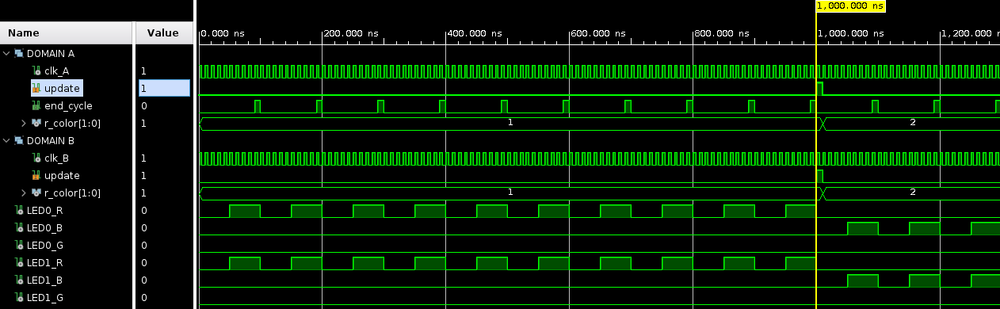

\newpage

* Question 5
#+begin_quote
Modifiez votre testbench tel que l’horloge ~clkA~ ait une fréquence de 250Mz et ~clkB~ 50MHz.
#+end_quote

** /Testbench/
/Testbench/:
- UUT: ~cirquit_q4~, \(f_{clkA}= 5 \times f_{clkB}\)
- VHDL: ~src/sim/tb_cirquit_q5.vhd~
- Configuration /waveform/: ~src/sim/tb_circuit_q5.wcfg~
- Paramètre ~D~ = 10, \(K=5\).

* Question 6
#+begin_quote
Lancer une simulation. Que se passe-t-il au niveau des signaux ~update~ des modules ~LED_driver~ ?
Qu’elle incidence cela a-t-il sur les LEDs ?
#+end_quote

** Simulation
La période de l'horloge ~clk_A~ du domaine \(A\) est \(\frac{1}{250.10^{6}} = 4\) ns. La période de l'horloge ~clk_B~ du domaine \(B\) est 20 ns.

Ainsi, du port de sortie ~cc_ready~ de ~CC_ITER~ dans le domaine \(A\), au port d'entrée ~update~ de ~DRV_LED1~ dans le domaine \(B\), la fréquence d'échantillonage[fn:sampling] est divisée par 5. Il est difficile d'espérer /observer/ un signal non ambiguë (Nyquist).

[fn:sampling] La fréquence des transferts RTL ~Q <= D~.

Il s'agit d'une situation de /Fast-to-Slow Clock Domain Crossing/: un signal produit dans le domaine avec la fréquence la plus élevée peut ne pas être /observable/ dans la logique séquentielle d'un domaine de moindre fréquence.

Effectivement, sur le chronographe Fig. [[fig:wvf_circuit_q5_fast2slow]]:
- Le signal ~update~ est /depuis longtemps/ retourné au niveau bas (/de-asserted/) lors du front d'horloge montant suivant dans le domaine \(B\): l'impulsion n'y est pas /vue/.
- Ainsi, dans le domaine \(B\) la LED rouge continuera de clignoter, tandis que la couleur passe au bleu dans le domaine \(A\).

#+CAPTION: /Fast-to-Slow Clock Domain Crossing/ , \(f_{clkA}= 5 \times f_{clkB}\).
#+NAME: fig:wvf_circuit_q5_fast2slow
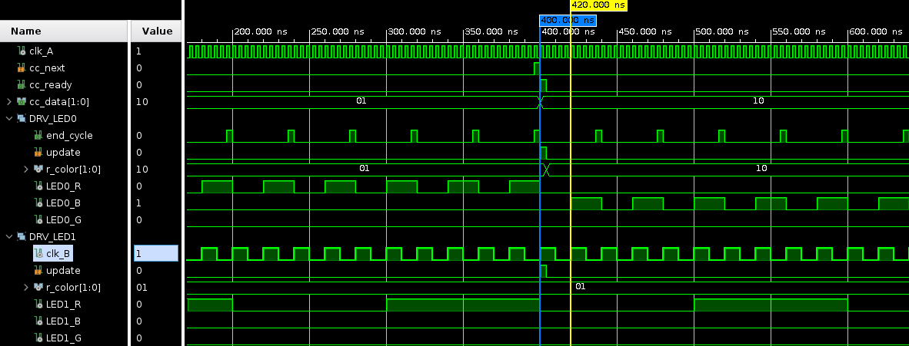

\newpage

* Question 7
#+begin_quote
Proposez une solution pour corriger le problème lié au changement de domaine d’horloge, vous pourrez vous aider du lien https://nandland.com/lesson-14-crossing-clock-domains/.
#+end_quote

** /Pulse Stretcher/
Pour transférer l'impulsion ~cc_ready~ du domaine \(A\) vers le port d'entre ~update~ dans le domaine \(B\), une approche est d'étirer (/stretch/) l'impulsion du domaine de plus haute fréquence pour qu'elle puisse être échantillonnée dans le domaine basse fréquence. C'est à dire un étirement  \(T_{stretch} = 2 \times T_{clkB} \).

Et, pour une horloge ~clk_A~ cinq fois plus rapide que ~clk_B~, \(T_{stretch} = 10 \times T_{clkA} \) comme illustré Fig. [[fig:pulse_stretcher]].

#+begin_src plantuml :file fig/pulse_stretcher.png :results silent
@startuml

clock "clk_A 250 MHz" as A with period 4 pulse 2 offset 0 <<clk_A>>
binary "update" as U <<update>>
binary "streched" as S <<stretch>>
clock "clk_B 50 MHz" as B with period 20 pulse 10 offset 0 <<clk_B>>

@0
U is LOW
S is LOW

@20
U is HIGH
S is HIGH

@24
U is LOW

@40
U is LOW

@60
S is LOW

@enduml

#+end_src

#+CAPTION: /Pulse Stretcher/.
#+NAME: fig:pulse_stretcher
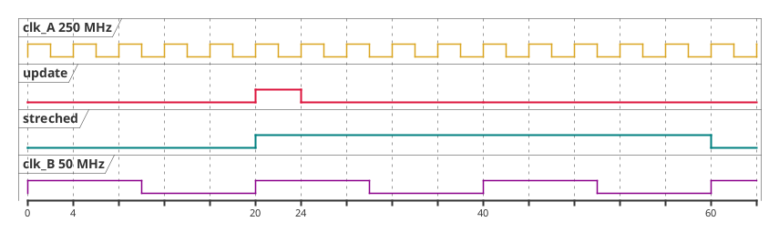

* Question 8
#+begin_quote
Mettez en place votre solution et testez-la en simulation.
Si votre résultat de simulation n’est toujours pas valide, proposez une autre solution.
#+end_quote

** Architecture RTL
L'insertion d'un tel /pulse stretcher/  \(T_{stretch} =10 \times T_{clkA}\) dans notre architecture est décrite Fig. [[fig:rtl_q7]].

#+CAPTION: Circuit Question 7 (/Pulse Strecher/).
#+NAME: fig:rtl_q7
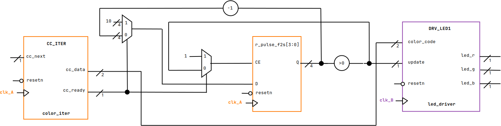

Le circuit introduit une nouveau paramètre configurant la longueur de l'impulsion étirée en nombre de périodes  \(T_{clkA}\).

#+CAPTION: Paramètre /Pulse Stretcher/.
#+NAME: table:generic_pulse_len
| /Générique/     | Configuration                           |
|---------------+-----------------------------------------|
| ~F2F_PULSE_LEN~ | Étirement \( \frac{T_{stretch}}{T_{clkA}}  \) |

** Architecture VHDL
Sources VHDL:
- Description du circuit Question 7: ~src/design/circuit_q7.vhd~
- Codes couleurs (/package/): ~src/design/color_codes_pkg.vhd~

** Simulation
/Testbench/:
- UUT: ~cirquit_q7~, \(f_{clkA}= 5 \times f_{clkB}\)
- VHDL: ~src/sim/tb_cirquit_q7.vhd~
- Configuration /waveform/: ~src/sim/tb_circuit_q7.wcfg~
- Paramètre ~D~ = 10, \(K=5\).

On vérifie:
- L'impulsion ~update~ en entrée de ~DRV_LED0~  dure toujours une période d'horloge ~clk_A~.
- L'impulsion ~update~ en entrée de ~DRV_LED1~ est étirée pour durer deux périodes d'horloge ~clk_B~, Fig. [[fig:wvf_tb_circuit_q7]].
- Les changements de codes couleur sont bien visibles dans les deux domaines \(A\) et \(B\).
- Les changements de couleur des deux LEDs ont lieu lorsque la ~LED0~ à clignoté 10 fois, Fig. [[fig:wvf_tb_circuit_q7_10]].

#+CAPTION: Impulsion ~update~ étirée, \(T_{stretch} =2 \times f_{clk_B}\).
#+NAME: fig:wvf_tb_circuit_q7
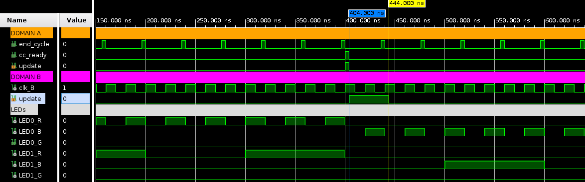

#+CAPTION: Chronographe ~tb_circuit_q7~, \(f_{clk_A} =5 \times f_{clk_B}\).
#+NAME: fig:wvf_tb_circuit_q7_10
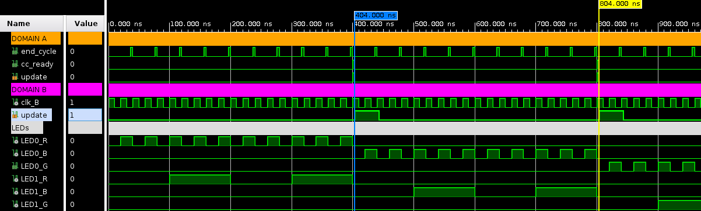

\newpage

* Question 9
#+begin_quote
Pour générer plusieurs horloges vous aurez besoin d’une PLL.
Trouvez quel est le nom de l’IP PLL de l’IP Catalog de Vivado puis ajoutez là à votre architecture.
La fréquence de l’horloge en entrée de la PLL est de 100MHz. Les deux horloges en sortie doivent être
à 50MHz et 250MHz.
#+end_quote

** IP PLL
L'horloge source est l'horloge du sous-système PL, 100 MHz.

Le catalogue Vivado propose l'IP Clock Wizard 6, qui peut synthétiser des horloges de différentes fréquences à partir d'une source, avec alignement des phases.

#+CAPTION: Configuration PLL Clock Wizard.
#+NAME: table:io_clk_wiz
| Clock | Type       | Fréquence |
|-------+------------+-----------|
| ~clk~   | Input (PL) | 100 MHz   |
| ~clk_A~ | PLL Output | 250 MHz   |
| ~clk_B~ | PLL Output | 50 MHz    |

** Architecture RTL
Les ports I/0 de l'IP Clock Wizard sont donnés Table [[table:io_clock_wiz]].

#+CAPTION: Ports I/O Clock Wizard.
#+NAME: table:io_clock_wiz
| Port   | Type | Signal                                  |
|--------+------+-----------------------------------------|
| ~clk~    | I    | Horloge PL                              |
| ~clk_A~  | O    | Horloge domaine ~A~                       |
| ~clk_B~  | O    | Horloge domaine ~B~                       |

** Architecture VHDL
Sources VHDL:
- Codes couleurs (/package/): ~src/design/color_codes_pkg.vhd~
- Description du circuit Question 9: ~src/design/circuit_q9.vhd~

  \newpage

* Question 10
#+begin_quote
Effectuez la synthèse et placer des sondes (ILA) sur les signaux pertinents pour vérifier que le changement de domaine d’horloge s’est correctement passé.
#+end_quote

** Sondes ILA
Le franchissement de domaine qui nous intéresse est celui du signal ~update~, pilotant les changements de couleurs:
- Directement connecté au stimulus ~cc_ready~ dans le domaine \(A\).
- Étiré par le /Pulse Stretcher/ dans le domaine \(B\).

Ces changements de couleur doivent apparaître:
- Tous les dix clignotements de la LED du domaine \(A\).
- Tous les deux clignotements de la LED du domaine \(B\), dont l'horloge est cinq fois moins rapide.

C'est ce dernier point que nous vérifierons en plaçant des sondes /debug/ sur les sorties LED du domaine \(B\):
- Sondes ~LED1_R_OBUF~,  ~LED1_B_OBUF~,  ~LED1_G_OBUF~.
- Domaine d'horloge ~clk_B~.
- /Trigger/ pour fronts montants et descendants (~==B~)
- Window data depth: 2
- Trigger position in window: 0
- Number of windows: quelques unes, disons 32

  \newpage

* Question 11
#+begin_quote
Etudiez le rapport de synthèse.
#+end_quote

** Rapports d'utilisation
- Utilization Design Information: ~synth/circuit_q9_utilization_synth.rpt~
- Synthesis report: ~synth/circuit_q9.vds~

#+CAPTION: Summary of Registers by Type.
#+NAME: table:synth_registers
| Total | Clock Enable | Synchronous | Asynchronous |
|-------+--------------+-------------+--------------|
|     3 | Yes          | -           | Set          |
|    68 | Yes          | -           | Reset        |

#+CAPTION: Primitives (synthèse).
#+NAME: table:synth_primitives
| Ref Name | Used | Functional Category |
|----------+------+---------------------|
| FDCE     |   68 | Flop & Latch        |
| LUT5     |   62 | LUT                 |
| LUT6     |   16 | LUT                 |
| CARRY4   |   14 | CarryLogic          |
| LUT3     |   10 | LUT                 |
| LUT4     |    9 | LUT                 |
| OBUF     |    6 | IO                  |
| FDPE     |    3 | Flop & Latch        |
| LUT1     |    2 | LUT                 |
| LUT2     |    1 | LUT                 |
| IBUF     |    1 | IO                  |

Nous avions, lors du TP4 - Partie 1, observé qu'une unité ~led_driver~ synthétise une trentaine de registres: 27 FDCE pour le compteur de type ~counter_unit~, plus  deux FDCE  et un FDPE pour l'unité ~led_driver~ elle-même.

Soit 58 FDCE et 2 FDPE pour les deux instances ~led_driver~.

Le circuit synthétisé ici introduit:
- Une unité ~color_iter~: 2 FDCE (MSB ~cc_data~ et ~cc_ready~), et 1 FDPE (LSB  ~cc_data~).
- Une unité ~circuit_q9~: 4 FDCE ~r_cycle_cnt~, plus 4 FDCE ~r_pulse_f2s~.

Soit effectivement 68 FDCE et 3 FDPE.

Un seul IBUF (~clk~), et 6 OBUF (les canaux RGB des deux LEDs).

Les ressources utilisées par l'IP PLL Vivado sont données Table [[table:synth_primitives_pll]].

#+CAPTION: Primitives IP PLL (synthèse).
#+NAME: table:synth_primitives_pll
| Ref Name   | Used | Functional Category |
|------------+------+---------------------|
| BUFG       |    3 | Clock               |
| PLLE2_ADV  |    1 | Clock               |
| IBUF       |    1 | IO                  |

\newpage

** Rapport de /Timing/ (STA)
- Timing Summary Report: ~synth/timing_report.txt~
- Design Analysis Report: ~synth/design_analysis_report.txt~

L'analyse statique Table [[table:synth_timing_summary]] produit des résultats TNS (Setup) et WNS (Hold) négatifs.

#+CAPTION: Design Timing Summary.
#+NAME: table:synth_timing_summary
| WNS(ns) | TNS(ns) | WHS(ns) | THS(ns) | WPWS(ns) | TPWS(ns) |
|---------+---------+---------+---------+----------+----------|
|  -0.538 | *-4.610*  |  -0.013 | *-0.026*  |      1.5 |    0.000 |

Les rapports montrent bien deux types de violations:
- /Setup/ pour des chemins intra-domaine \(A\): la limitation est ici le /design/ VHDL du compteur de temporisation ~counter_unit~, qu'il nous faudra corriger pour passer les tests de /timing/ avec une fréquence d'horloge de 250 MHz.
- /Hold/ pour des chemins inter-domaines: l'analyse semble ne pas avoir pleinement reconnu le /Pulse Stretcher/.

*** Intra-domaine, violations Setup
Les chemins causant ces violations aboutissent au compteur de temporisation de l'unité ~DRV_LED0~, à l'intérieur du domaine d'horloge ~clk_A~, 250 MHz.

Synthétiser l'incrémentation d'un compteur 27-bit, ou sa comparaison avec une valeur de même magnitude, produits des chemins RTL qui peuvent se révéler coûteux (/longs/) et ne plus être /négligeables/ à haute fréquence (ici 250 MHz).

Le /design/ VHDL du /compteur de temporisation/ place de plus la comparaison avec le modulo sur le chemin de la logique de sortie ~end_counter~, qui, /in fine/, est le signal pulsation de l'ensemble du circuit.

Modifier ce /design/ VHDL, en pré-calculant et /cachant/ la comparaison en dehors de la logique de sortie ~end_counter~, suffit à éliminer les violations /Setup/ rapportées. Le /patcth/ appliqué ici est donné en Annexe.

#+CAPTION: Violations intra-domaine, /Setup/.
#+NAME: fig:synth_setup_violations
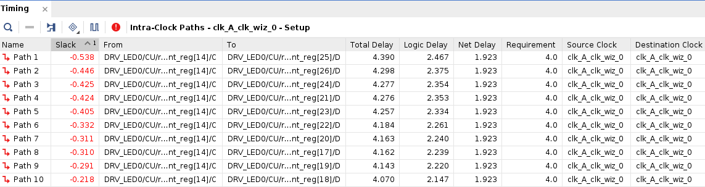

*** Inter-domaines, violations Hold
Ces violations sont associées à des chemins RTL /Fast-to-Slow,/ du domaine d'horloge ~clk_A~ vers le domaine ~clk_B~, et pourraient révéler un état /métastable/ d'un registre du domaine \(A\) au moment de l'enregistrement de sa sortie dans le registre du domaine \(B\) ~r_color~.

Or nous savons que le registre ~cc_data~ du domaine \(A\) en entrée de ~r_color~ sera stable pendant \(10 \times 2.10^{8}\) périodes d'horloge ~clk_A~, soit  \(4.10^{8}\) périodes d'horloge ~clk_B~ après assertion du signal  ~update~. L'enregistrement d'un niveau métastable semble donc largement improbable.

L'analyse statique semble par ailleurs ne pas avoir pleinement reconnu le /Pulse Stretcher/, et le rôle du registre ~r_pulse_f2s~.

Ces violations s'évanouissent lors du placement & routage, et ne retiendront pas davantage notre attention.

#+CAPTION: Violations inter-domaines, /Hold/.
#+NAME: fig:synth_hold_violations
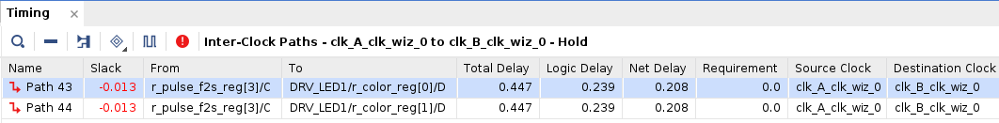

* Question 12
#+begin_quote
Effectuez le placement routage et étudiez les rapports générés.
#+end_quote

** Implémentation
Fichiers de contraintes: ~src/const/cdc.xdc~

*** Placement & Routage
- Utilization - Place Design: ~impl/circuit_q9_utilization_placed.rpt~

Les ressources utilisées après placement  & routage correspondent à celles synthétisées.

Les deux registres supplémentaires (70 FDCE et non 68) que l'on pourrait remarquer sont ajoutés par le /patch/ appliqué précédemment pour corriger le /design/ VHDL du module ~counter_unit~.

#+CAPTION: Summary of Registers by Type.
#+NAME: table:impl_registers
| Total | Clock Enable | Synchronous | Asynchronous |
|-------+--------------+-------------+--------------|
|     3 | Yes          | -           | Set          |
|    70 | Yes          | -           | Reset        |

*** Rapports de Timing (STA)
- Timing Summary Report: ~impl/timing_report.txt~

L'implémentation ne révèle pas de violation /Setup Time/ ni /Hold Time/, ce qui semble valider l'approche adoptée lors de l'analyse des rapports de synthèse.

#+CAPTION: Design Timing Summary.
#+NAME: table:impl_timing_summary
| WNS(ns) | TNS(ns) | WHS(ns) | THS(ns) | WPWS(ns) | TPWS(ns) |
|---------+---------+---------+---------+----------+----------|
|   0.767 | *0.000*   |   0.170 | *0.000*   |      1.5 |    0.000 |

* Question 13
#+begin_quote
Générez le bitstream, programmez la carte et vérifiez les signaux du chipscope (ILA).
#+end_quote

** Bitstream
- Bitstream (2 MB): ~impl/circuit_q9.bit~

*** ILA
La forme des ondes instrumentées pour les LEDs de sortie du domaine \(B\) est donnée Fig. [[fig:wvf_ila_drv_led1]].

On peut vérifier que la périodicité des changements de couleur, c'est à dire 10 clignotements dans le domaine \(A\), n'est plus que de deux clignotements dans le domaine \(B\) d'horloge cinq fois moins rapide.

#+CAPTION: Sondes ILA ~LED1~
#+NAME: fig:wvf_ila_drv_led1
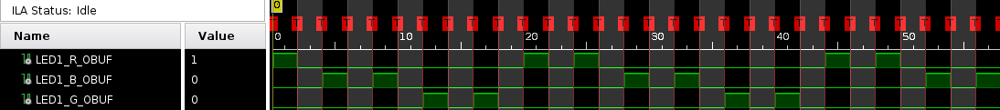

*** Démonstration
Scénario de démonstration vérifié sur carte Cora Z7 (~xc7z010clg400-1~):
- Au démarrage, les deux LEDs rouges clignotent.
- Lorsque la LED rouge du domaine \(A\) a clignoté 10 fois, et la LED rouge du domaine \(B\) deux fois, les deux LEDs bleues clignotent.
- Lorsque la LED bleue du domaine \(A\) a clignoté 10 fois, et la LED bleue du domaine \(B\) deux fois, les deux LEDs vertes clignotent.
- Lorsque la LED verte du domaine \(A\) a clignoté 10 fois, et la LED verte du domaine \(B\) deux fois, les deux LEDs rouges clignotent.

\newpage

* /Patch/ ~counter_unit~

L'approche [fn:patch] est de pré-calculer et enregistrer la coûteuse comparaison ~r_count + 1 = K - 1~ pour la retirer de  logique de sortie ~end_counter~.

#+begin_src diff
--- counter_unit.vhd    2026-09-03 21:06:48.689877525 +0200
+++ counter_unit_sta_fix.vhd    2026-09-03 21:00:34.343536814 +0200
@@ -47,28 +47,36 @@
   -- FIXME: initial state should rely on Power-on Reset signal.
   signal r_count  : unsigned(N-1 downto 0) := (others => '0');

-  -- Wired to the combinatorial logic for r_count = K - 1.
-  signal w_modK   : std_logic;
+  -- Pre-compute and register condition (r_count + 1 = K - 1)
+  -- to avoid some delay on end_counter output logic.
+  signal r_modK   : std_logic := '0';

   begin

-    -- Combinatorial circuit.
-    -- Evaluated on rising edges, when r_count is updated.
-    w_modK <= '1' when (r_count = K - 1) else '0';
-    end_counter <= w_modK;
+    -- Pre-computed, no output logic.
+    end_counter <= r_modK;

     rtl: process(clk, resetn)
     begin

       if (resetn = '0') then
         r_count <= (others => '0');
+        r_modK <= '0';

       elsif rising_edge(clk) then
-        if (w_modK = '1') then
+        -- r_count + 1 = K - 1, avoiding overflows.
+        if (r_count = K - 2) then
+          r_modK <= '1';
+        else
+          r_modK <= '0';
+        end if;
+
+        if (r_modK = '1') then
           r_count <= (others => '0');
         else
           r_count <= r_count + 1;
         end if;
+
       end if;

     end process rtl;
#+end_src

[fn:patch] Pour appliquer le /patch/: ~cd src/design && patch counter_unit.vhd < counter_unit_sta_fix.patch~
