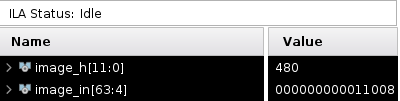
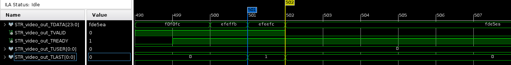
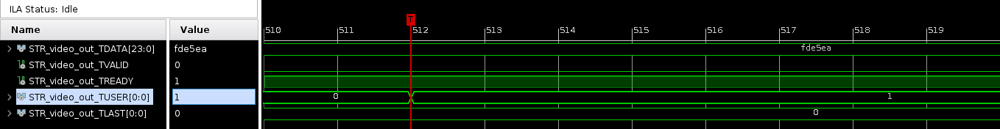

#+title: Rapport Validation
#+AUTHOR: Christophe Dufaza
#+LANGUAGE: fr
#+LATEX_CLASS: article
#+LATEX_HEADER: \usepackage[a4paper,top=2cm, bottom=2cm]{geometry}
#+LATEX_HEADER: \usepackage{hyperref}
#+LATEX_HEADER: \hypersetup{colorlinks=true,linkcolor=cyan}
#+LATEX_HEADER: \usepackage{graphicx}
#+OPTIONS: date:nil
#+OPTIONS: toc:2
#+LATEX: \tableofcontents

\newpage

| SRS                | Validation | Statut |
|--------------------+------------+--------|
| 2.1 [PL-IP-000]    | I-2.1_1    | X      |
|                    | A-2.1_1    | X      |
|                    | T-2.1_1    | X      |
|                    | T_2.1_2    | X      |
|                    | T-2.1_3    | .      |
|                    | D-2.1_1    | X      |
| 2.2. [PL-IP-001]   | A-2.2_1    | X      |
|                    | D-2.2_1    | X      |
| 2.3 [PL-IP-002]    | I-2.3_1    | X      |
|                    | D_2.3_1    | X      |
| 2.4 [PL-IP-002]    | D-2.4_1    | X      |
| 2.6. [PL-IP-005]   | I-2.6_1    | .      |
| 2.7. [PL-IP-006]   | A-2.7_1    | .      |
| ...                | ...        | .      |
| 2.12. [PL-IP-006]  | ...        | .      |
| 2.13 [PL-DISP-002] | A-2.13.1   | .      |
|                    | D-2.13.1   | X      |
| 2.14 [PL-DISP-003] | A-2.14_1   | .      |
|                    | D-2.14_2   | .      |
| 3.1. [PS-001]      | T_3.1_1    | X      |
| 3.2. [PS-002]      | T_3.2_1    | .      |
| 3.3. [PS-003]      | A-3.3_1    | X      |
|                    | D-3.3_1    | X      |
|                    | A-3.3_2    |  .     |

* 2. FPGA image processing

** 2.1. [PL-IP-000] Source Vidéo mémoire [1]
*** I-2.1_1 Architecture MM2S
Sur le /design/ SoCTrack:
- on identifie les composants ~axi_dma24_fb_ctrl_0~ (/driver/ AP, /register space/ de configuration), ~smartconnect_ddr~ et ~DMA24bUnit_mm2s_0~ (memoire lecture DMA et production du flux AXIS)
- on vérifie le domaine d'horloge AXI (~aclk~)
- on vérifie polarité et domaine d'horloge des /reset/ synchrones (AXI InterConnect, AXI SmartConnect)

Le SRS est satisfait.

*** A-2.1_1 Conversion bi-directionnelle RGB8/AXI4-Stream
#+begin_example
$ cd DMA_RGB24b/hls && make csim
./tb_dma24b
Image 640x480 lue, format memoire = RGB888 packe (3 o/px), 16 pixel(s)/groupe,
3 mot(s) AXI4/groupe
Echantillons de sortie ecrits dans samples/output
Erreurs data  : 0
Erreurs tlast : 0
Erreurs tuser : 0
TEST PASSED
The maximum depth reached by any of the 1 hls::stream() instances in the design is 307200
The maximum depth reached by any of the 1 hls::stream() instances in the design is 0
#+end_example

Le SRS est satisfait.

*** T-2.1_1 Espaces d'adressage AXI
On vérifie l'espace d'adressage AXI pour /le frame buffer/:
#+begin_example
$ mwr -size b -bin -file sample_in_rgb.bin 0x00110080 921600
$ mrd -size b -bin -file memory.bin 0x00110080 921600
$ diff sample_in_rgb.bin memory.bin
#+end_example

On vérifie le /register space/ sur le chronographe ILA Fig. [[fig:T-2.1_1-ila-regspace]].

Le SRS est satisfait.

#+CAPTION: Register space
#+NAME: fig:T-2.1_1-ila-regspace

*** T-2.1_2 Protocole AXI4-Stream
Note: activer la capture ILA après téléchargement de l'image en mémoire, e.g.  ~mwr -size b -bin -file sample_in_rgb.bin 0x00110080 921600~.

On vérifie les pré-requis sur le chronographe ILA Fig. [[fig:T-2.1_2-ila-tlast]] et [[fig:T-2.1_2-ila-tuser]].

#+CAPTION: TLAST & EOL
#+NAME: fig:T-2.1_2-ila-tlast

#+CAPTION: TUSER & SOF
#+NAME: fig:T-2.1_2-ila-tuser

Le SRS est satisfait.

*** T-2.1_3 Support 60 FPS
Le SRS n'est pas satisfait (validation non mise en oeuvre).

*** D-2.1_1 Restitution image
On vérifie l'image affichée Fig. [[fig:D-2.1_1-img]]

Le SRS est satisfait.

#+CAPTION: Image DDR/DMA.
#+NAME: fig:D-2.1_1-img
[[file:dev/figs/D-2.1_1-img.png]]

** 2.2. [PL-IP-001] Source Vidéo TPG [1]
*** A-2.2_1 Protocole AXI4-Stream Test Pattern Generator
Le SRS est satisfait.

*** D-2.2_1 Visualisation de la mire
La mire peut être observée Fig. [[fig:D-2.2_1-tpg]], ou sur une vidéo: ~https://youtu.be/aCMtNJG_Zlo~

#+CAPTION: Test Pattern Generator
#+NAME: fig:D-2.2_1-tpg
[[file:dev/figs/D-2.2_1-tpg.png]]

Le SRS est satisfait.

** 2.3 [PL-IP-002] Sélection de source vidéo init [1]
*** I-2.3_1 Multiplexer AXI
Sur le /design/ SoCTrack:
- On identifie le composant ~axis_mux~ , 2:1 MUX AXIS
- La sélection est pilotée (/driven/) par le signal ~i_axis_sel~ interconnecté au /register space/.

Le SRS est satisfait.

*** D-2.3_1 Sélection source vidéo initiale
Le système énumère la configuration des registres après initialisation:

#+begin_example
CTRL_REG_STATUS:        0x0x84a00000    0x00000000
CTRL_REG_FB_WIDTH:      0x0x84a00004    640
CTRL_REG_FB_HEIGHT:     0x0x84a00008    480
CTRL_REG_FB_ADDR_HIGH:  0x0x84a00010    0x00000000
CTRL_REG_FB_ADDR_LOW:   0x0x84a0000c    0x00110080

CTRL_REG_AXIS_SEL: CTRL_AXIS_SEL_TPG
#+end_example

La source initiale configurée (Test Pattern Generator, ~CTRL_AXIS_SEL_TPG~) peut être observée sur le moniteur VGA..

Le SRS est satisfait.

** 2.4 [PL-IP-002] Sélection de source vidéo à chaud [1]
*** D-2.4_1 Sélection source vidéo à chaud

Les commandes XSCT ci-dessous sélectionnent la source vidéo demandée:
#+begin_example
puts "Switching AXIS source to CTRL_AXIS_SEL_IMG"
mwr 0x84a00000 0x00000001
after 3000

puts "Switching AXIS source to CTRL_AXIS_SEL_TPG"
mwr 0x84a00000 0x00000000
after 3000

puts "Switching AXIS source to CTRL_AXIS_SEL_IMG"
mwr 0x84a00000 0x00000001
after 3000

puts "Switching AXIS source to CTRL_AXIS_SEL_TPG"
mwr 0x84a00000 0x00000000
after 3000
#+end_example

Voir vidéo: ~https://youtu.be/SG7bUdcbpYQ~

Le SRS est satisfait.

** 2.5 [PL-IP-004] Architecture filtre à convolution [1]
** 2.6. [PL-IP-005] Standards de transferts [1]
*** I-2.6_1 Protocole AXI4-Stream
Le SRS n'est pas satisfait (non implémenté).

** 2.7. [PL-IP-006] Filtre gaussien [1]
Le SRS n'est pas satisfait (non implémenté).

** 2.8. [PL-IP-007] Filtre Harris [1]
Le SRS n'est pas satisfait (non implémenté).

** 2.9. [PL-IP-008] Filtre Harris binarisation [1]
Le SRS n'est pas satisfait (non implémenté).

** 2.10. [PL-IP-009] Filtre Harris seuillage paramétrable [1]
Le SRS n'est pas satisfait (non implémenté).

** 2.11. [PL-IP-010] Filtre Harris retour de données [2]
Le SRS n'est pas satisfait (non implémenté).

** 2.12.  [PL-DISP-001] Overlay [1]
Le SRS n'est pas satisfait (non implémenté).

** 2.13. [PL-DISP-002] Affichage écran VGA [1]
*** A-2.13.1 Mode VGA 480p
Le SRS n'est pas satisfait (validation non mise en oeuvre).

*** D-2.13_1 Affichage moniteur
Voir Fig. [[fig:D-2.2_1-tpg]], ou sur une vidéo: ~https://youtu.be/aCMtNJG_Zlo~.

La LED1 confirme le vérouillage.
Le SRS est satisfait.

** 2.14. [PL-DISP-003] Mode d’affichage [2]
*** A-2.14_1
Le SRS n'est pas satisfait (non implémenté).

*** D-2.14_2
Le SRS n'est pas satisfait (non implémenté).

* 3. SoC
** 3.1. [PS-001] Mise en mémoire manuelle pattern [1]
*** T_3.1_1 Mise en mémoire manuelle
Voir T-2.1_1 Espaces d'adressage AXI.

Le SRS est satisfait.

** 3.2. [PS-002] Mise en mémoire automatique pattern [2]
*** T_3.2_1 Mise en mémoire automatique
Le SRS n'est pas satisfait (non implémenté).

** 3.3. [PS-003] Retour de données UART [2]
*** A-3.3_1 Configuration UART
On vérifie la configuration UART dans le /design/ du système.

Le SRS est satisfait.

*** D-3.3_1 Console UART
Le retour console UART est observé au démarrage du système:
#+begin_example
--------
SoCTrack

main():     0x00100750
FB address: 0x00110080

CTRL_REG_STATUS:        0x84a00000    0x00000000
CTRL_REG_FB_WIDTH:      0x84a00004    640
CTRL_REG_FB_HEIGHT:     0x84a00008    480
CTRL_REG_FB_ADDR_HIGH:  0x84a00010    0x00000000
CTRL_REG_FB_ADDR_LOW:   0x84a0000c    0x00110080

CTRL_AXIS_SEL: CTRL_AXIS_SEL_TPG
#+end_example

Le SRS est satisfait.

*** A-3.3_2 Score maximal et coordonnées
Le SRS n'est pas satisfait (non implémenté).
